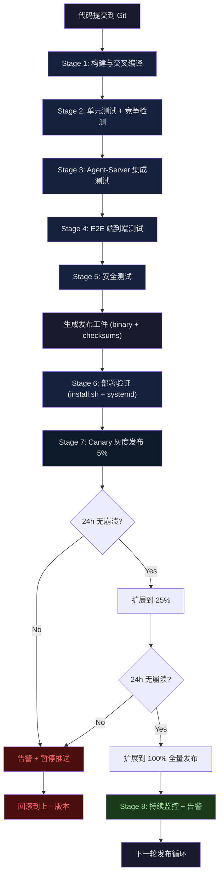
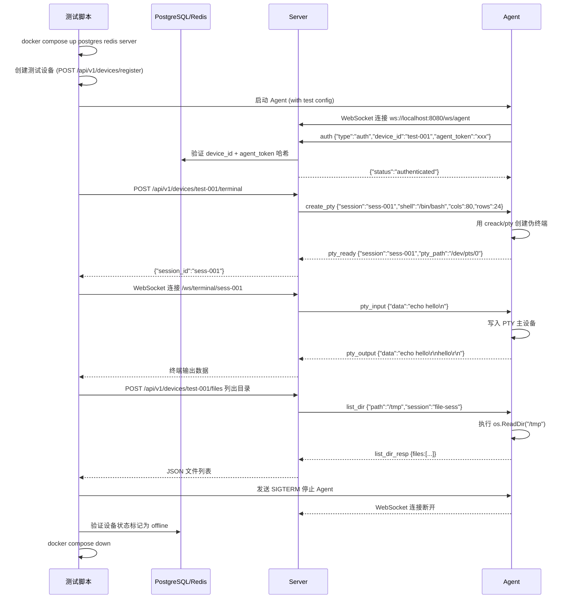

# Agent 全生命周期测试规划

Feature Name: agent-lifecycle-testing
Updated: 2026-04-18

## Description

本设计文档涵盖了 EdgePilot Agent 从代码提交后的完整生命周期测试流程：构建编译 -> 单元测试 -> 集成测试 -> E2E 测试 -> 安全测试 -> 部署验证 -> 生产灰度发布 -> 监控与回滚。每个阶段都有明确的检查项、自动化脚本和退出标准。

## Architecture



## Components and Interfaces

### 阶段 1: 构建与交叉编译 (Build)

| 组件 | 说明 |
|------|------|
| **Makefile** (`agent/Makefile`) | 构建入口，包含 `build`、`cross-compile`、`test`、`clean` 目标 |
| **Go 构建工具链** | `go build` 配合交叉编译目标 `GOOS=linux GOARCH=arm64/amd64` |
| **Checksum 生成器** | `sha256sum` 生成 `checksums.txt` 文件 |
| **Git Tag/Version** | 从 `git describe --tags` 或环境变量 `VERSION` 获取版本号 |

**构建流程**:
```bash
# 1. 拉取依赖
go mod download

# 2. 运行测试并检查覆盖率
go test -race -coverprofile=coverage.out ./...
go tool cover -func=coverage.out  # 输出各函数覆盖率

# 3. 交叉编译 (添加 trimpath 和 ldflags)
GOOS=linux GOARCH=arm64 go build -trimpath -ldflags="-s -w -X main.Version=$(git describe --tags 2>/dev/null || echo dev)" -o dist/robot-agent-arm64 ./cmd/agent
GOOS=linux GOARCH=amd64 go build -trimpath -ldflags="-s -w -X main.Version=$(git describe --tags 2>/dev/null || echo dev)" -o dist/robot-agent-amd64 ./cmd/agent

# 4. 生成校验和
cd dist && sha256sum robot-agent-* > checksums.txt && cd ..
```

### 阶段 2: 单元测试 (Unit Tests)

| 组件 | 说明 |
|------|------|
| **Go Test** | `go test -race -cover ./...` |
| **表驱动测试** | 使用 `[]struct{ name, input, want }` 模式编写测试用例 |
| **竞争检测** | `-race` 标志检测 goroutine 数据竞争 |

**覆盖目标模块**:
- `internal/client/` - WebSocket 客户端：状态机、重连逻辑、心跳间隔
- `internal/config/` - 配置加载、环境变量解析、默认值、校验
- `internal/pty/` - PTY 会话：创建、读写、resize、关闭、semaphore 限制
- `internal/fileop/` - 文件操作：目录列出、读取、写入（含 bak 备份）、删除、权限过滤
- `pkg/logger/` - 日志级别过滤、格式化输出

**新增测试建议**:
```go
// internal/config/config_test.go - 配置校验
func TestConfig_Validation(t *testing.T) {
    tests := []struct {
        name    string
        cfg     *config.Config
        wantErr bool
    }{
        {"missing server url", &config.Config{AgentToken: "x", DeviceID: "y"}, true},
        {"missing agent token", &config.Config{ServerURL: "wss://x", DeviceID: "y"}, true},
        {"valid config", &config.Config{ServerURL: "wss://x", AgentToken: "y", DeviceID: "z"}, false},
    }
    for _, tt := range tests {
        t.Run(tt.name, func(t *testing.T) {
            err := tt.cfg.Validate()
            if (err != nil) != tt.wantErr {
                t.Errorf("Validate() error = %v, wantErr %v", err, tt.wantErr)
            }
        })
    }
}

// internal/fileop/handler_test.go - 路径过滤
func TestHandler_IsProtectedPath(t *testing.T) {
    tests := []struct {
        path string
        want bool
    }{
        {"/etc/shadow", true},
        {"/proc/1/cmdline", true},
        {"/tmp/test", false},
        {"/home/user/.bashrc", false},
        {"/sys/class/net", true},
    }
    for _, tt := range tests {
        t.Run(tt.path, func(t *testing.T) {
            if got := IsProtectedPath(tt.path); got != tt.want {
                t.Errorf("IsProtectedPath(%s) = %v, want %v", tt.path, got, tt.want)
            }
        })
    }
}
```

### 阶段 3: 集成测试 (Integration Tests)

| 组件 | 说明 |
|------|------|
| **Test Server** | 使用 `docker compose` 启动 PostgreSQL + Redis + Server |
| **Test Agent** | 编译后的 Agent 以子进程方式启动，连接测试 Server |
| **HTTP Test Client** | 通过 Server API 创建设备、终端会话、触发文件操作 |

**集成测试流程**:


### 阶段 4: E2E 端到端测试

| 组件 | 说明 |
|------|------|
| **Playwright** | 浏览器自动化框架，支持 Chromium、Firefox、WebKit |
| **Server** | 真实后端（与集成测试共用 Docker Compose 环境） |
| **Agent** | 容器化 Agent（模拟边缘设备） |
| **测试浏览器** | 模拟用户从登录到操作终端、文件、登出的完整流程 |

**E2E 测试场景**:

| 编号 | 场景 | 前置条件 | 步骤 | 预期结果 |
|------|------|----------|------|----------|
| E2E-1 | 用户登录 | Server 和 Agent 运行中 | 输入邮箱密码 -> 点击 Login | 跳转到 Dashboard，显示在线设备 |
| E2E-2 | 打开终端 | 设备在线 | 点击 Terminal -> 等待加载 | xterm.js 显示 shell prompt |
| E2E-3 | 终端执行命令 | 终端已打开 | 输入 `echo "hello123"` -> 回车 | 终端显示 `hello123` |
| E2E-4 | 文件浏览 | 设备在线 | 点击 Files -> 查看目录 | 显示 `/` 目录下的文件和文件夹 |
| E2E-5 | 文件编辑保存 | 存在可编辑文件 | 点击文件名 -> 修改内容 -> Save | 弹窗显示"File saved"，刷新后内容更新 |
| E2E-6 | 危险命令拦截 | 终端已打开 | 输入 `rm -rf /` -> 回车 | 终端显示"Command blocked"错误信息 |
| E2E-7 | 用户登出 | 已登录 | 点击 Logout 按钮 | 跳转到登录页，localStorage 无 token |

### 阶段 5: 安全测试

| 类别 | 测试项 | 方法 |
|------|--------|------|
| **通信安全** | WSS 强制 | 尝试用 `ws://` 连接 Agent，应被拒绝 |
| **认证安全** | Token 伪造 | 使用无效/过期 Token 连接，应被 Server 拒绝 |
| **命令过滤** | 危险命令 | 通过终端发送黑名单命令，应被拦截 |
| **命令确认** | 敏感命令 | 通过终端发送 `sudo rm -f /tmp/x`，应要求二次确认 |
| **路径保护** | 路径遍历 | 尝试 `../../../etc/passwd`，应被 Agent 过滤 |
| **路径保护** | 敏感文件 | 尝试读取 `/etc/shadow`，应被 Agent 拒绝 |
| **会话限制** | PTY 数量限制 | 尝试创建 4 个并发 PTY 会话，第 4 个应被拒绝 |
| **心跳超时** | 心跳丢失 | 停止 Agent 心跳，Server 应在 90s 标记 heartbeat_miss |
| **重连保护** | 指数退避 | 关闭 Server，Agent 应使用指数退避重连 |

### 阶段 6: 部署验证

| 组件 | 说明 |
|------|------|
| **install.sh** | 自动安装脚本（检测架构、下载二进制、配置 systemd） |
| **Docker (模拟边缘设备)** | 使用多架构 Docker 镜像（arm64v8, amd64）模拟不同设备 |
| **uninstall.sh** | 卸载脚本（停止服务、删除二进制、清理配置） |
| **验证脚本** | 自动化验证 Agent 安装是否正确 |

**部署验证流程**:
```bash
# 在 Docker (模拟 arm64 设备) 中测试安装
docker run --platform linux/arm64 --rm -it ubuntu:22.04 bash -c '
  apt-get update && apt-get install -y curl systemd
  # 挂载 install.sh 和 binary
  curl -fsSL http://test-server/install.sh | bash -s -- --token=test-token --server=wss://test-server/ws/agent
  # 验证安装
  systemctl status robot-agent
  journalctl -u robot-agent --no-pager -n 20
'

# 测试卸载
curl -fsSL http://test-server/uninstall.sh | bash
# 验证卸载
test ! -f /usr/local/bin/robot-agent && echo "Binary removed OK"
```

### 阶段 7: 灰度发布与回滚

```
Canary (5%)     ->  观察 24 小时  ->  崩溃率 > 2% ?  ->  暂停/回滚 : 继续
  \                                                             |
   v                                                            v
Batch (25%)    ->  观察 24 小时  ->  崩溃率 > 2% ?  ->  暂停/回滚 : 继续
  \                                                             |
   v                                                            v
Full Rollout (100%)  ->  监控 7 天  ->  无异常 ->  标记此版本为 stable
```

| 阶段 | 覆盖比例 | 观察周期 | 退出条件 |
|------|----------|----------|----------|
| Canary | 5% | 24 小时 | 崩溃率 < 2%，无安全漏洞报告 |
| Batch | 25% | 24 小时 | 崩溃率 < 2%，用户反馈正常 |
| Full | 100% | 7 天 | 所有设备升级完成，旧版本设备 < 5% |

**回滚触发**:
- Agent 崩溃率 > 2%
- Server 端 Agent 连接异常率 > 5%
- 发现 Critical 安全漏洞
- 用户反馈功能异常（终端无法连接、文件操作失败等）

### 阶段 8: 持续监控

| 监控项 | 指标 | 告警阈值 | 告警方式 |
|--------|------|----------|----------|
| Agent 在线率 | 在线设备数 / 总设备数 | < 90% | Dashboard 高亮 + Email |
| 心跳延迟 | 最近心跳时间到现在 | > 90 秒 | 设备标红 |
| 终端会话数 | 当前活跃的 PTY 数 | > 峰值 80% | 日志 warn 级别 |
| Agent 版本分散 | 设备按版本分布统计 | > 3 个活跃版本 | 提醒运维清理旧版本 |
| 崩溃率 | 最近 24 小时 Agent 重启次数 | > 2% 设备崩溃 | PagerDuty + Email |

## Data Models

### Agent 状态机

```
StateDisconnected --connectWithRetry--> StateConnecting
StateConnecting   --dial+auth success--> StateConnected
StateConnected    --auth response recv--> StateAuthenticated
StateAuthenticated --msg loop start--> StateAuthenticated
StateAuthenticated --connection lost--> StateDisconnected
StateConnected    --connection lost--> StateDisconnected
StateConnecting   --err before auth--> StateDisconnected
```

### Agent 构建产物

| 文件 | 架构 | 说明 |
|------|------|------|
| `robot-agent-arm64` | Linux ARM64 | Jetson/Nano/Raspberry Pi |
| `robot-agent-amd64` | Linux AMD64 | x86 服务器 |
| `checksums.txt` | - | SHA256 校验和 |
| `install.sh` | - | 安装脚本 |
| `uninstall.sh` | - | 卸载脚本 |
| `agent.service` | - | systemd 服务定义 |
| `agent.env.example` | - | 配置文件模板 |

### Agent 配置 (agent.env)

| 变量 | 类型 | 必填 | 默认值 | 说明 |
|------|------|------|--------|------|
| `SERVER_URL` | URL | Yes | - | WebSocket 服务器地址 (wss://) |
| `AGENT_TOKEN` | string | Yes | - | 设备认证 Token |
| `DEVICE_ID` | string | Yes | - | 设备唯一标识 |
| `PLATFORM` | string | No | linux | 设备平台类型 |
| `ARCH` | string | No | 自动检测 | 设备架构 (arm64/amd64) |
| `LOG_LEVEL` | string | No | info | 日志级别 (debug/info/warn/error) |
| `HEARTBEAT_INTERVAL` | int | No | 30 | 心跳间隔（秒） |

## Correctness Properties

1. **构建确定性**: 相同代码 + 相同 Go 版本 + 相同构建标志 = 相同 SHA256 校验和（使用 `-trimpath` 保证）
2. **状态机完整性**: Agent 状态转换必须遵循 `Disconnected -> Connecting -> Connected -> Authenticated -> Disconnected` 的合法路径
3. **重连指数退避**: 第 N 次重连间隔 = min(2^N * 1s, 30s)，N = [0..4]，第 5 次后每分钟尝试一次
4. **路径安全**: 任何文件操作请求，经过 `sanitizedPath` + `IsProtectedPath` + `path traversal check` 后，不能访问 Agent 不允许的路径
5. **命令过滤完整性**: 命令过滤器必须覆盖所有已知的高风险命令模式（正则匹配 + 子命令匹配）
6. **心跳保活**: 心跳间隔内，Agent 必须成功发送心跳，服务端必须在收到心跳后更新设备状态
7. **会话上限**: Agent 同时允许的 PTY 会话数不超过 3，超过应返回错误
8. **部署幂等**: 执行 `install.sh` 多次应产生相同结果（不会重复安装或损坏配置）

## Error Handling

### 错误分类与处理策略

| 错误类型 | 发生位置 | 处理方式 | 恢复 |
|----------|----------|----------|------|
| 构建失败 | CI/CD | 中止流程，输出详细错误日志 | 开发者修复代码后重新提交 |
| 测试失败 | CI/CD | 中止流程，标记 PR 为不通过 | 开发者修复测试或代码后重新提交 |
| 集成测试超时 | 集成测试环境 | 记录超时日志，终止测试，中止流程 | 检查 Docker 资源，重试 2 次 |
| Agent 连接失败 | Agent | 指数退避重连 (1s -> 30s)，5 次后每分重试 | 网络恢复后自动重连 |
| Agent 认证失败 | Agent | 记录错误日志，停止重连，等待人工干预 | 检查 Token 正确性后手动重启 |
| Agent PTY 创建失败 | Agent | 返回错误给 Server，释放 semaphore | Shell 可用后自动恢复 |
| Agent 文件操作失败 | Agent | 返回错误给 Server (含错误原因) | 无，需人工排查 |
| Agent 崩溃 | 边缘设备 | systemd `Restart=always` 自动重启 | systemd 自动重启 (RestartSec=10) |
| Server 下线 | Server | Agent 重连机制处理 | Server 恢复后 Agent 重连 |
| 灰度发布崩溃 | 生产 | 暂停推送，触发回滚流程 | 自动回滚到上一稳定版本 |
| 安装脚本失败 | 边缘设备 | 输出日志到 stderr，回滚变更 | 人工根据日志排查后重试 |

## Test Strategy

### 测试阶段总览

| 阶段 | 类型 | 自动化? | 运行时机 | 时长 | 退出标准 |
|------|------|---------|----------|------|----------|
| 构建 | 编译验证 | Yes | 每次 commit | < 2 min | 两个架构 binary + checksums 生成 |
| 单元测试 | Unit tests | Yes | 每次 commit | < 1 min | 所有通过，覆盖率 >= 70% |
| 集成测试 | Agent-Server | Yes | PR 合并到 main | < 5 min | 所有场景通过 |
| E2E 测试 | 浏览器自动化 | Yes | PR 合并到 main, 发布前 | < 10 min | 所有场景通过 |
| 安全测试 | 手动 + 自动 | Partial | 发布前 | < 30 min | 无 Critical/High 级别漏洞 |
| 部署验证 | 安装/卸载 | Yes | 发布前 | < 3 min | 两个架构安装成功且服务 active |
| 灰度发布 | 生产验证 | Yes (自动) | 生产发布时 | 24-48h | 崩溃率 < 2% |
| 全量发布 | 生产验证 | Yes (自动) | 灰度通过后 | 7 天 | 所有设备升级完成 |

### 测试目录结构建议

```
agent/
├── tests/
│   ├── unit/           # 单元测试 (内联在包的 _test.go 文件中)
│   ├── integration/    # 集成测试 (需要 Server + DB)
│   │   ├── docker-compose.test.yml  # 测试环境 Docker Compose
│   │   └── integration_test.go      # Agent-Server 集成测试入口
│   ├── e2e/            # E2E 测试 (需要 Playwright + 全量环境)
│   │   ├── playwright.config.ts     # Playwright 配置
│   │   └── specs/                   # 测试场景
│   │       ├── login.spec.ts
│   │       ├── terminal.spec.ts
│   │       ├── files.spec.ts
│   │       └── security.spec.ts
│   └── security/       # 安全测试
│       └── security_test.go          # 命令过滤、路径保护测试
└── Makefile            # 包含 test, test-integration, test-e2e 目标
```

### CI/CD Pipeline 流程

```
push/PR
  │
  ├── Stage 1: Build (cross-compile arm64 + amd64)
  │       └── 产物: dist/robot-agent-{arm64,amd64} + checksums.txt
  │
  ├── Stage 2: Unit Tests (-race -cover)
  │       └── 出口标准: 100% 通过, coverage >= 70%
  │
  ├── Stage 3: Integration Tests (Docker Compose: DB + Server + Agent)
  │       └── 出口标准: 所有 WebSocket 交互场景通过
  │
  ├── Stage 4: E2E Tests (Playwright + 全量环境)
  │       └── 出口标准: 所有浏览器操作场景通过
  │
  ├── Stage 5: Security Tests (自动 + 手动)
  │       └── 出口标准: 无 Critical/High 漏洞
  │
  ├── [如果通过] → Stage 6: 发布工件到 artifacts server
  │
  ├── Stage 7: Canary (5%) → 24h 观察 → Batch (25%) → 24h 观察 → Full (100%)
  │
  └── Stage 8: Monitor (持续 7 天) → 标记 stable
```

## References

[^1]: (agent/internal/client/client.go) - Agent WebSocket 客户端核心实现
[^2]: (agent/internal/pty/manager.go) - PTY 终端管理器
[^3]: (agent/internal/fileop/handler.go) - 文件操作处理器
[^4]: (server/internal/websocket/hub.go) - 设备连接 Hub
[^5]: (server/internal/websocket/gateway.go) - WebSocket 网关
[^6]: (agent/install.sh) - 安装脚本
[^7]: (agent/uninstall.sh) - 卸载脚本
[^8]: (agent/agent.service) - systemd 服务配置
[^9]: (server/internal/service/command_filter.go) - 命令过滤器
[^10]: (server/internal/api/handlers/heartbeat.go) - 心跳处理
[^11]: (agent/internal/client/client_test.go) - 现有单元测试示例
